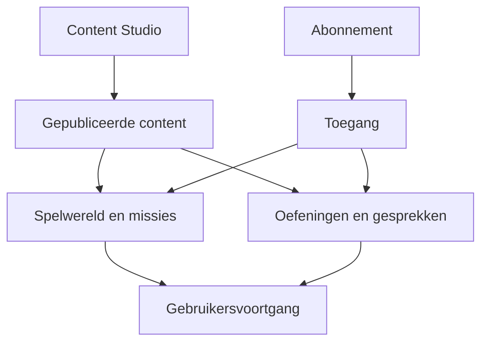
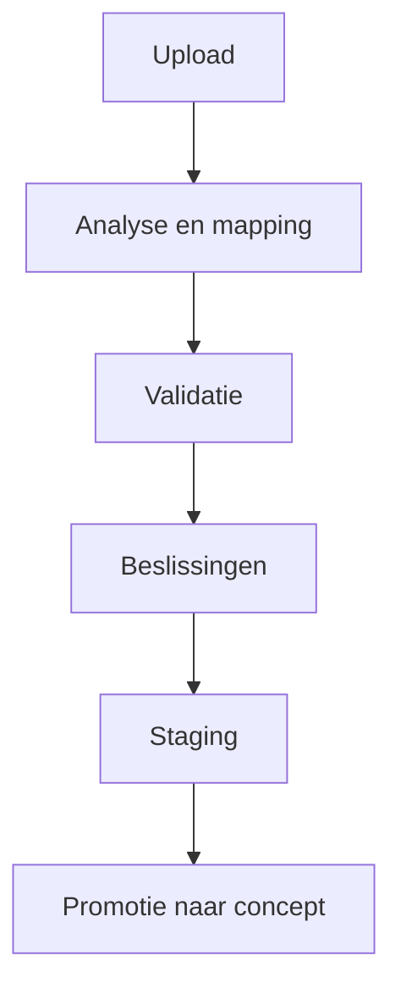
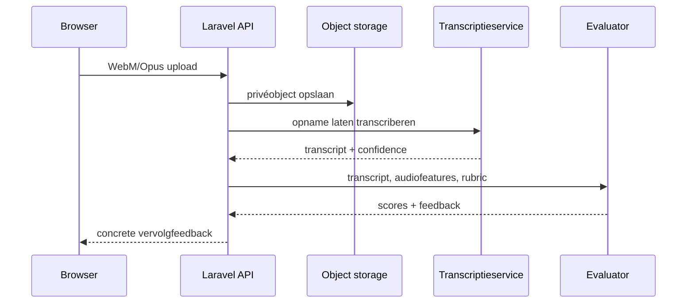

# Canoniek domein- en datamodel

Status: voorstel voor de eerste zelfstandige versie van Spaansspreken.nl  
Doelstack: PHP/Laravel, MySQL 8.0.16+, Tailwind-frontend, object storage voor media  
Bronbestand: [`database/schema.sql`](../../database/schema.sql)

## 1. Ontwerpdoelen

Het model ondersteunt één zelfstandig platform met vier samenhangende domeinen:

1. **Content Studio** voor woorden, zinnen, grammatica, oefeningen, wereldobjecten, missies en gespreksscenario's.
2. **Spelwereld** voor de verkenning van Spanje, te beginnen met Madrid en de bakkerij.
3. **Leer-runtime** voor voortgang, herhaling, missiepogingen, gesprekken en spreekbeoordeling.
4. **Commercie** voor een proefperiode en betaalde abonnementen.

De voornaamste ontwerpregels zijn:

- Content die in het spel verschijnt heeft altijd een canonieke `content_nodes`-identiteit, publicatiestatus en versie.
- Een externe import wordt nooit direct gepubliceerd. Een rij blijft eerst herleidbaar in staging en levert hooguit een nieuw concept op.
- Pogingen verwijzen behalve naar content-ID's ook naar de gebruikte contentversie. Daardoor blijven historische scores verklaarbaar nadat een auteur content wijzigt.
- De dialoogmotor voert het gesprek; een afzonderlijk geversioneerde evaluator beoordeelt de leerprestatie.
- Spraakopnamen blijven in het oorspronkelijke browserformaat WebM/Opus. De applicatie gebruikt geen ffmpeg-conversiestap.
- Kaartgegevens, oefenconfiguratie en vertakkingsregels mogen JSON gebruiken; relaties waarop wordt gezocht of gerapporteerd krijgen echte tabellen en foreign keys.
- Alle tijden worden als UTC in `DATETIME(6)` opgeslagen. De presentatie converteert naar de tijdzone van de gebruiker.
- Er wordt geen betaalkaartinformatie opgeslagen. Alleen ondoorzichtige referenties van de betaalprovider worden bewaard.

## 2. Domeingrenzen

`content_nodes` is de gedeelde contentgrens. De runtime leest uitsluitend gepubliceerde content. Preview- en redactieroutes mogen concepten lezen als de gebruiker daarvoor een Content Studio-rol heeft.

### 2.1 Aggregaten

| Aggregaat | Aggregate root | Belangrijkste onderdelen | Consistentieregel |
|---|---|---|---|
| Content | `content_nodes` | localizations, revisions, media, tags, vakspecifieke tabel | type, slug, status en versie zijn leidend |
| Import | `import_batches` | import records, bron en mapping | iedere bronrij blijft traceerbaar |
| Wereld | `regions` / `locations` | NPC's, items, kaartconfiguratie | een locatie hoort bij precies één regio |
| Missie | `missions` | stappen, vereisten en beloningen | posities en sleutels zijn uniek per missie |
| Gespreksscenario | `conversation_scenarios` | nodes, edges en intents | nodes en edges horen inhoudelijk bij hetzelfde scenario |
| Missiepoging | `mission_attempts` | step attempts, oefen- en gesprekspogingen | de gebruikte missieversie wordt vastgelegd |
| Gesprekssessie | `conversation_sessions` | turns en speaking attempts | dialoogmotor en evaluator zijn apart geversioneerd |
| Abonnement | `subscriptions` | provider-events | provider-events worden idempotent verwerkt |

## 3. Content Studio

### 3.1 Canonieke content-envelop

Alle redactionele objecten beginnen als record in `content_nodes`. Deze tabel bevat generieke gegevens:

- `content_type`: allowlist in applicatiecode, bijvoorbeeld `lexeme`, `phrase`, `exercise`, `region`, `location`, `npc`, `mission` of `conversation_scenario`;
- unieke `slug` binnen een type;
- workflowstatus `draft → in_review → changes_requested/approved → scheduled → published → withdrawn/archived`;
- `schema_version` voor wijzigingen in de gegevensvorm;
- `current_version` en `published_at` voor versiebeheer en runtime-selectie;
- auteursvelden, timestamps en soft delete.

Een typespecifieke tabel gebruikt `content_node_id` tegelijk als primaire sleutel en foreign key. Zo kan een contentobject niet bestaan zonder publicatie-envelop, terwijl elk type wel sterke kolommen en constraints houdt.

De canonieke statuswaarden sluiten één-op-één aan op de Content Studio:

| Databasewaarde | Weergavenaam | Betekenis |
|---|---|---|
| `draft` | Concept | Bewerkbare redactionele versie |
| `in_review` | In review | Ingediende versie wordt beoordeeld |
| `changes_requested` | Wijzigingen gevraagd | Review vraagt aanpassingen vóór herindiening |
| `approved` | Goedgekeurd | Inhoudelijk gereed voor een release |
| `scheduled` | Gepland | Opgenomen in een geplande release |
| `published` | Gepubliceerd | Actieve productieversie |
| `withdrawn` | Ingetrokken | Niet meer actief voor nieuwe sessies |
| `archived` | Gearchiveerd | Niet-actieve redactionele inhoud |

`staged` is bewust geen `content_nodes`-status: staging hoort uitsluitend bij `import_records`. Promotie maakt een nieuw contentobject met status `draft`. De aparte revisionstatus `rejected` betekent dat een concrete revisie is afgewezen; de bewerkbare aggregate root gaat daarbij naar `changes_requested`.

`content_localizations` bevat titel, samenvatting en redactionele tekst per taal. `content_revisions` bewaart een onveranderlijke JSON-snapshot van iedere ingediende versie. Publiceren gebeurt in één transactie:

1. controleer dat het huidige revision-record is goedgekeurd;
2. valideer het typespecifieke record en alle benodigde relaties/media;
3. verhoog `current_version`;
4. zet status en `published_at`;
5. schrijf een auditlog en een outbox-event.

### 3.2 Taalkundige content

| Tabel | Functie |
|---|---|
| `lexemes` | Spaans lemma, woordsoort, geslacht, getal, lidwoord, CEFR en verbuigingen/vervoegingen |
| `lexeme_translations` | één of meer Nederlandse betekenissen per lemma |
| `phrases` | bruikbare Spaanse uitdrukking met communicatieve functie en register |
| `example_sentences` | voorbeeldzin met optionele Nederlandse vertaling |
| `grammar_topics` | compacte grammaticale uitleg en gestructureerde regeldata |
| `exercises` | oefentype, instructies, scoremodel en verwachte duur |
| `exercise_items` | prompts, antwoorden, feedback en doelcontent |

Relaties zoals “voorbeeld bij woord”, “vereist woord” en “oefent grammaticaonderwerp” lopen via `content_relations`. De applicatie hanteert per relatietype een allowlist van toegestane bron- en doeltypes. Dat kan niet met een gewone SQL-foreign key worden afgedwongen en moet daarom in service- en validatielagen worden getest.

### 3.3 Media

`media_assets` bevat uitsluitend metadata en een storage-objectkey; geen binaire bestanden. Content kan via `content_media` meerdere rollen krijgen, zoals `hero`, `map_marker`, `npc_portrait`, `npc_expression_sheet`, `audio_es` of `ambient_audio`.

Vanaf fase 3B4 verwijst iedere `content_media`-koppeling ook naar de exacte `content_revision`. Daardoor blijven preview, review en release herleidbaar tot dezelfde onveranderlijke combinatie van speeldata en media. De objecten zelf staan privé op de geconfigureerde Laravel-disk. Content Studio leest ze via een ingelogde beheerroute; vanaf fase 3B5 kan de publieke runtime uitsluitend publiceerbare media van exact de actuele openbare productierevisie streamen via een versie- en rolgebonden URL.

Gebruikersopnamen staan bewust niet in `media_assets`, maar in `speech_recordings`. Hierdoor kunnen bewaartermijnen en verwijdering van persoonlijke audio onafhankelijk van redactionele media worden uitgevoerd.

## 4. Import als inspiratiebron

De importketen bestaat uit:

- `content_sources`: waar het materiaal vandaan komt, inclusief bronsoort, herkomst, licentie en attributie;
- `import_batches`: bestand/checksum, gekozen kolommapping, tellerstanden en uitvoerstatus;
- `import_records`: originele en genormaliseerde payload, validatie-uitkomst, reviewbeslissing en verwerkingslevenscyclus.

Een batch doorloopt de gedeelde workflowstatussen:

`uploaded → analyzed → mapping_required → validation_required → decisions_required → ready_for_staging → staged/partially_staged → completed`.

`failed` en `cancelled` zijn eind- of herstelstatussen buiten het normale pad. Een batch mag alleen direct van `analyzed` door wanneer automatische mapping geen gebruikerskeuze vereist. `partially_staged` betekent dat de bruikbare selectie is geïsoleerd terwijl overige regels bewust zijn afgewezen of overgeslagen.

Elke importregel heeft drie onafhankelijke statusassen:

| As | Veld | Waarden | Doel |
|---|---|---|---|
| Technische/inhoudelijke validatie | `validation_status` | `pending`, `valid`, `warning`, `invalid`, `possible_duplicate` | resultaat van normalisatie, validatie en duplicaatdetectie |
| Menselijke beslissing | `review_status` | `pending`, `needs_review`, `accepted`, `rejected` | expliciete redactionele of rechtenbeslissing |
| Verwerkingslevenscyclus | `lifecycle_status` | `pending`, `staged`, `promoted`, `skipped`, `deleted` | wat na de beslissing met het record is gebeurd |

Deze scheiding voorkomt dat bijvoorbeeld `warning` verloren gaat zodra een record wordt gestaged. `deleted` betekent dat het record niet meer beschikbaar is voor de redactionele workflow; provenance en auditmetadata blijven volgens het bewaarbeleid bestaan.

Elke importregel krijgt standaard:

- `validation_status = pending`, `review_status = pending` en `lifecycle_status = pending`;
- `proposed_content_status = draft`;
- een checksum voor deduplicatie;
- een herleidbare batch, bron en rijnummer;
- pas na menselijke acceptatie eerst `lifecycle_status = staged`;
- bij promotie een `resulting_content_node_id` naar nieuwe content met status `draft` en `lifecycle_status = promoted`.

Daarmee is import altijd **staging en inspiratie**, niet een alternatieve productiebron. De applicatie publiceert nooit automatisch uit `import_records`. De raw payload blijft onveranderd; correcties horen in `normalized_payload` en daarna in de nieuwe conceptcontent.

## 5. Spelwereld en missieopbouw

### 5.1 Wereldhiërarchie

- `regions` vormt een boom van land, autonome gemeenschap, provincie of stadshub. `map_geometry` ondersteunt eenvoudige polygonen of een pointer naar rijkere kaartdata.
- `locations` zijn speelbare plaatsen zoals een plein, bakkerij, station of apotheek. De coördinaten zijn relatieve kaartcoördinaten, geen GPS-verplichting.
- `npcs` koppelt een redactionele persona en stemconfiguratie aan een thuislocatie.
- `item_definitions` beschrijft verzamelobjecten, cosmetische items, quest-items en badges.

`unlock_rule` en `availability_rule` zijn declaratieve JSON-regels. Ze worden door één `RuleEvaluator` geïnterpreteerd en nooit als uitvoerbare PHP-code opgeslagen.

### 5.2 Missies

Een `mission` bevat metadata, startlocatie, CEFR-niveau, basis-XP en toegangseisen. De lineaire hoofdlijn bestaat uit geordende `mission_steps`. Een stap kan verwijzen naar een oefening of gespreksscenario via `referenced_content_node_id`.

Missies kunnen elkaar blokkeren via `mission_prerequisites`. `mission_rewards` kent XP, confianza, valentía, munten of een item toe. Toekenning schrijft altijd eerst een unieke regel in `game_ledger`; daarna wordt de projectiestand in `user_game_states` of `user_inventory` bijgewerkt. De `idempotency_key` voorkomt dubbele beloningen bij retries.

## 6. Gespreksscenario's

Een scenario kan volledig gescript, hybride of generatief zijn:

- `conversation_nodes` beschrijft het gesprek als toestanden;
- `conversation_edges` bevat prioriteit, voorwaarden en effecten;
- `conversation_intents` beschrijft wat de speler communicatief moet bereiken;
- `conversation_node_intents` koppelt verwachte of verplichte intents aan een leerdersbeurt.

Voorwaarden en effecten zijn declaratieve JSON. Bij het opslaan valideert de Content Studio dat:

1. er precies één startnode is;
2. iedere niet-terminale node minstens één uitgaande route heeft;
3. alle nodes vanaf de start bereikbaar zijn;
4. `from_node_id`, `to_node_id` en intents tot hetzelfde scenario behoren;
5. het scenario een veilige uitweg heeft als spraakherkenning of AI faalt.

De laatste vier regels zijn graaf- en cross-table-regels die doelbewust in Laravel-validatie en integratietests worden afgedwongen.

## 7. Gebruikersvoortgang

`user_game_states` is een snelle projectie voor de interface. De controleerbare historie staat in:

- `mission_attempts` en `mission_step_attempts`;
- `exercise_attempts`;
- `conversation_sessions` en `conversation_turns`;
- `speaking_attempts`;
- `game_ledger` voor alle valuta- en XP-mutaties.

`user_mastery` bewaart beheersing en spaced-repetitionplanning per contentobject. Voor de eerste versie is één generiek schema voldoende; een latere algoritmewijziging kan extra velden of een mastery-eventtabel toevoegen.

`user_npc_states` maakt NPC-geheugen en vertrouwen mogelijk. `memory_summary` en `memory_facts` mogen alleen spelrelevante informatie bevatten. Vrije gevoelige persoonsgegevens of conclusies over gezondheid, afkomst of overtuigingen horen hier niet thuis.

## 8. Spreken en beoordeling

### 8.1 Opnamebeleid

`speech_recordings` accepteert `audio/webm` of `video/webm` met codec `opus`. Het object blijft privé in object storage en wordt via tijdelijke, ondertekende URL's ontsloten. Er is geen conversie met ffmpeg. Backendvalidatie controleert minimaal MIME-type, magic bytes/container, maximale grootte, maximale duur en checksum.

Een recording bevat `consent_version` en `retention_until`. Een opschoontaak verwijdert na de bewaartermijn het storage-object en markeert `deleted_at`. `speaking_attempts.speech_recording_id` gebruikt `ON DELETE SET NULL`, zodat leerfeedback kan blijven bestaan nadat de bronopname is verwijderd.

### 8.2 Gescheiden verantwoordelijkheden

- `conversation_sessions.dialogue_engine_version` registreert de motor die de NPC-reactie koos.
- `conversation_sessions.evaluator_version` registreert de onafhankelijke beoordelingsworkflow.
- `speaking_attempts` registreert transcriptie- en evaluatieprovider/model/rubric afzonderlijk.
- Scores voor uitspraak, vloeiendheid, verstaanbaarheid en taakvoltooiing blijven los beschikbaar; `overall_score` is een afgeleide rubricscore.

Een transcriptieconfidence is geen uitspraakscore. Bij lage confidence vraagt het product eerst om herhaling of biedt het een alternatief, in plaats van de speler automatisch af te keuren.

## 9. Proefperiode en abonnementen

`subscription_plans` beschrijft prijs, valuta, interval, proefduur en rechten. `subscriptions` is de lokale toegangsprojectie en bevat providerreferenties, periode en status. `subscription_events` is de idempotente webhook-inbox.

Toegangsbeslissingen verlopen via één `EntitlementService`:

1. bepaal de meest recente geldige subscription;
2. geef tijdens `trialing` toegang tot de proefcontent en geconfigureerde rechten;
3. geef tijdens `active` toegang volgens `entitlements` van het plan;
4. hanteer een expliciete grace-policy voor `past_due`;
5. blokkeer betaalde content bij `expired` of na het effectieve einde van `cancelled`.

De betaalprovider blijft de bron voor financiële afwikkeling. De applicatie bewaart geen kaartnummers, CVC, bankgegevens of volledige factuurpayloads wanneer die niet functioneel nodig zijn.

## 10. Integriteit, indexen en transacties

### 10.1 Foreign keys

- `CASCADE` wordt gebruikt voor echte onderdelen zonder zelfstandige betekenis, zoals revisions, mission steps en turns.
- `RESTRICT` beschermt historische leerdata tegen het verwijderen van gebruikte gepubliceerde content.
- `SET NULL` bewaart historie wanneer een optionele redactionele of operationele verwijzing verdwijnt.
- Soft delete is de normale route voor gebruikers, content, bronnen, media en plannen. Fysieke delete is een gecontroleerde privacy- of retentieoperatie.

### 10.2 Belangrijkste indexpatronen

Het schema bevat expliciete indexen voor:

- redactionele werkvoorraad: status, type en wijzigingsdatum;
- importreview: status, batch en rijnummer;
- contentlookup: type/slug, lemma, CEFR en tags;
- wereldnavigatie: regio en sorteervolgorde;
- actieve of recente gebruikerspogingen;
- verschuldigde herhaling: gebruiker en `next_review_at`;
- spreekverwerking: status en creatiedatum;
- abonnementstoegang: gebruiker, status en periode-einde;
- webhookverwerking en outboxrecords die nog niet zijn verwerkt.

Gebruik `EXPLAIN ANALYZE` met realistische volumes voordat nieuwe samengestelde indexen worden toegevoegd. JSON-velden die structureel onderdeel van filtering worden, moeten worden gepromoveerd naar een gewone of generated column met index.

### 10.3 Transactiegrenzen

Gebruik database-transacties voor:

- content publiceren;
- een stap voltooien en de volgende ontgrendelen;
- een missie afronden, ledgermutaties boeken en inventaris/projecties bijwerken;
- een abonnementsevent idempotent verwerken;
- een importrecord accepteren en de bijbehorende conceptcontent maken.

Voor externe AI-, transcriptie-, mail- en betaalcalls geldt het outbox/inbox-patroon. Houd geen databasetransactie open tijdens een netwerkcall.

## 11. Soft delete, audit en privacy

### 11.1 Soft-deletebeleid

Mutable hoofdtabellen hebben waar nodig `deleted_at`. Historische en append-only tabellen, zoals attempts, ledgers, provider-events en auditlogs, krijgen bewust geen algemene soft delete. Correcties gebeuren met een compenserend event of expliciete status.

Laravel global scopes moeten in de Content Studio zichtbaar kunnen worden uitgezet voor een prullenbakweergave, maar publieke queries moeten verwijderde records altijd uitsluiten.

### 11.2 Audit

`audit_logs` registreert wijzigingen aan content, rollen, importbeslissingen en abonnementstoegang. `before_state` en `after_state` moeten worden gefilterd: geen wachtwoordhashes, tokens, volledige betaalpayloads of ruwe audio/transcripten. `ip_hash` gebruikt een periodiek roterende salt en is alleen bedoeld voor beveiligingsonderzoek.

`domain_events` is de transactionele outbox. Een worker publiceert events na commit en vult `published_at`. Consumenten moeten idempotent zijn.

### 11.3 Verwijdering en anonimisering

Bij een privacyverzoek wordt een gecontroleerde workflow gebruikt:

1. account blokkeren;
2. audio-objecten verwijderen;
3. direct identificerende profielvelden wissen of pseudonimiseren;
4. leerdata verwijderen of loskoppelen volgens het vastgestelde bewaarbeleid;
5. wettelijk noodzakelijke abonnementsadministratie minimaliseren en afgeschermd bewaren;
6. de uitvoering registreren zonder de verwijderde gegevens in het auditlog te kopiëren.

Definitieve bewaartermijnen horen in een apart privacy- en retentiebeleid en niet hardcoded in dit schema, behalve `retention_until` voor uitvoerbare opschoonjobs.

## 12. Laravel-implementatierichtlijnen

- Zet deze DDL om naar kleine, thematische Laravel-migrations; gebruik dit bestand als canonieke ontwerpbaseline en niet als één monolithische productiemigratie.
- Gebruik backed enums voor statussen en value objects voor locale, CEFR, geldbedragen en scores.
- Modelleer typespecifieke content als expliciete Eloquent-relaties, niet als een onbeperkte polymorfe `payload`-tabel.
- Gebruik policies voor `author`, `reviewer`, `publisher`, `support` en `admin`; rollen geven geen impliciete publicatierechten zonder policycheck.
- Gebruik optimistic locking op `content_nodes.current_version` en `user_game_states.state_version`.
- Maak import, transcriptie, evaluatie, audioverwijdering, webhookverwerking en outboxpublicatie queue-jobs met idempotency keys.
- Bewaar providersecrets uitsluitend in environment/secrets management, nooit in JSON-configuratiekolommen.
- Test alle CHECK-constraints ook op applicatieniveau voor duidelijke Nederlandstalige foutmeldingen.

## 13. Beslissingen voor de vertical slice Madrid → La panadería

Voor de eerste complete keten zijn minimaal nodig:

- één Madrid-regio en één bakkerijlocatie;
- één bakker-NPC met stemconfiguratie;
- een kleine set lexemes, phrases, audio en voorbeeldzinnen;
- één voorbereidende oefening;
- één hybride gespreksscenario met herstelroutes;
- één missie met oefen-, gesprek- en checkpointstap;
- confianza/valentía/XP en ten minste één Spaans verzamelitem als beloning;
- een mission attempt, conversation session en WebM speaking attempt;
- een proefabonnement met toegang tot deze content;
- één CSV-importbatch die uitsluitend conceptwoorden oplevert.

Deze vertical slice test daarmee het volledige model van redactie en import tot spreken, feedback, voortgang en abonnementstoegang zonder al een tweede architectuurpad te introduceren.
