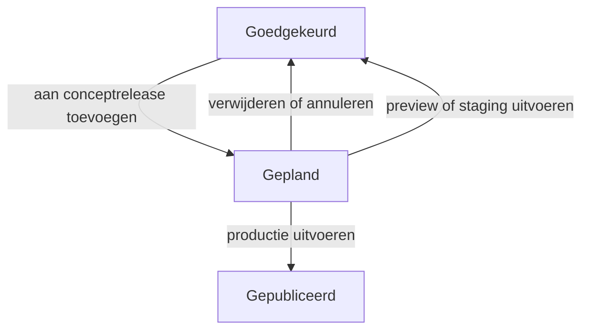

# Content Studio-releaseworkflow

Fase 1E maakt de stap van goedgekeurde redactiecontent naar een gecontroleerde kanaaluitvoering. De implementatie volgt het release-, rollen- en statusmodel uit `docs/content-studio.md` en bouwt rechtstreeks voort op de versiegebonden reviewworkflow.

## Mogelijkheden

- alle Content Studio-rollen kunnen releasehistorie bekijken;
- alleen Beheerder en Hoofdredacteur kunnen releases maken, samenstellen, uitvoeren of annuleren;
- een release bewaart naam, omschrijving, doelkanaal, gewenst publicatiemoment, eigenaar en exacte contentrevisies;
- alleen een actuele, aantoonbaar goedgekeurde revisie kan worden toegevoegd;
- toevoegen zet content atomair van `Goedgekeurd` naar `Gepland`;
- verwijderen of annuleren zet de betrokken content atomair terug naar `Goedgekeurd`;
- iedere uitvoering herhaalt de preflight binnen dezelfde databasetransactie;
- productie vereist de exacte bevestiging `PUBLICEREN`, handmatige erkenning van zichtbare waarschuwingen en een motivatie;
- preview en staging leggen een reproduceerbare uitvoering vast zonder content publiek te maken;
- release- en contentovergangen worden afzonderlijk in het append-only auditlog opgeslagen.

## Status- en kanaalgedrag



Een release zelf start als `Conceptrelease` en eindigt als `Uitgevoerd` of `Geannuleerd`. Een uitgevoerde of geannuleerde release is via de reguliere applicatieroutes niet meer te wijzigen.

Preview en staging zijn bewust veilig: ze registreren het versiegebonden resultaat, maar zetten `content_nodes.status` terug op `approved` en laten `published_at` leeg. Alleen een productierelease zet content op `published` met een publicatietijdstip.

## Preflight

De huidige preflight blokkeert wanneer:

- de release geen items bevat;
- de release niet langer een concept is;
- een contentobject niet meer `Gepland` is;
- het actuele versienummer afwijkt van het release-item;
- de gekoppelde revisie ontbreekt of bij een ander contentobject hoort;
- voor die exacte revisie geen goedkeuringsgebeurtenis bestaat;
- een speelbare regio of gesprek geen ingevuld en ondersteund scene-contract heeft;
- een gekoppeld medium ontbreekt of is gearchiveerd;
- media geen aantoonbaar publicatierecht hebben, verlopen zijn of alt-tekst/transcript missen;
- het gewenste publicatiemoment nog in de toekomst ligt.

De controle wordt zowel op het detailscherm getoond als opnieuw uitgevoerd onder databasevergrendeling tijdens publicatie. Een verouderd scherm kan daardoor geen gedeeltelijke publicatie veroorzaken.

Mediabestanden en hun revisiegebonden rollen worden nu volledig gecontroleerd. Tekstuele herkomst- en licentievelden zijn nog niet volledig gemodelleerd en blijven daarom een zichtbare handmatige waarschuwing.

## Menselijke beslispoort

De functionaliteit maakt productiepublicatie technisch mogelijk, maar voert zelf geen release uit. Volgens `AGENTS.md` beslist alleen de producteigenaar definitief over productie. Het productieformulier toont daarom de volledige bundel, vereist een foutloze preflight, handmatige erkenning van de zichtbare relationele/rechtenwaarschuwing, de hoofdlettergevoelige bevestiging `PUBLICEREN` en een auditbare motivatie.

## Bewuste afbakening

- nog geen automatische scheduler of wachtrijtaak voor toekomstige publicatiemomenten;
- nog geen terugtrek- of rollbackrelease voor reeds gepubliceerde content;
- mediarechten en toegankelijkheidsmetadata worden gevalideerd; algemene tekstherkomst en relaties volgen nog;
- de publieke runtime-API staat beschreven in `docs/public-content-api.md`; typed relaties en spelerstatus vallen nog buiten deze releasefase;
- kanaalpreview en de nieuwe voortgangsvrije objectpreview hebben verschillende doelen: de objectpreview test een actuele revisie, de kanaaluitvoering blijft het reproduceerbare releasebewijs.

De releaseworkflow is nu de enige publicatie-ingang voor de versieerbare read-only API. De volgende blauwdrukstap is de test- en kwaliteitsstraat voor het volledige Fase 1-skelet.

## Deployment en terugrol

Voer na deployment uit:

```bash
php artisan migrate --force
php artisan optimize
php artisan test
```

De migratie maakt `content_releases` en `content_release_items`. Terugrollen kan samen met een code-rollback via:

```bash
php artisan migrate:rollback --step=1
```

Maak vóór terugrollen een databaseback-up zodra echte releasehistorie bestaat. Terugrollen verwijdert de releasebundels, maar draait reeds uitgevoerde contentstatussen niet automatisch terug; gebruik het alleen samen met een gecontroleerde herstelprocedure.

## Acceptatiecriteria

- alleen rollen met `publish` kunnen releasebeheer muteren;
- alleen goedgekeurde actuele revisies zijn toevoegbaar;
- release-items blijven versiegebonden aan content en revisie;
- lege, toekomstige of verouderde releases zijn niet uitvoerbaar;
- productie vereist expliciete bevestiging en motivatie;
- een fout in één item voorkomt iedere publicatiewrite;
- preview en staging maken content nooit publiek;
- annuleren herstelt alle ingeplande content atomair naar `Goedgekeurd`;
- iedere geslaagde overgang is herleidbaar via release- én contentauditregels.
