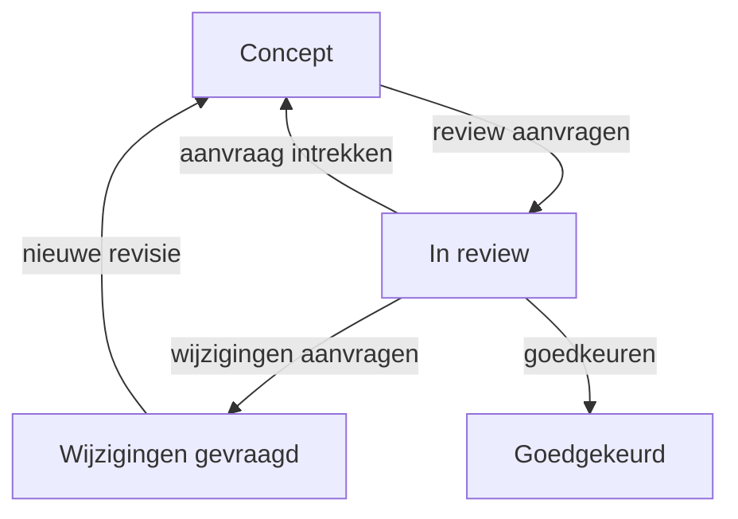

# Content Studio-reviewworkflow

Fase 1D voegt de eerste volledige redactionele statusovergangen toe aan de Content Studio. Deze slice volgt het statusmodel, de rollen en de reviewwachtrij uit `docs/content-studio.md`.

## Mogelijkheden

- een bevoegde eigenaar of hoofdredacteur kan een actuele conceptversie voor review indienen;
- content in review is vergrendeld voor bewerking en archivering;
- Beheerder, Hoofdredacteur en Taalreviewer kunnen de reviewwachtrij openen;
- een reviewer kan een ingediende revisie goedkeuren of met verplichte motivatie wijzigingen aanvragen;
- risicogestuurde review laat Beheerder en Hoofdredacteur gewone eigen revisies gemotiveerd goedkeuren, terwijl gevoelige inhoud altijd een onafhankelijke reviewer vereist;
- de maker kan een lopende reviewaanvraag gemotiveerd intrekken en daarna verder bewerken;
- speelbare regio's en gesprekken moeten vóór review een geldig scene-contract hebben;
- iedere aanvraag en beslissing is gekoppeld aan exact één contentrevisie;
- reviewgebeurtenissen en inhoudelijke auditregels zijn append-only.

## Statusovergangen



Een reviewbeslissing controleert binnen een databasetransactie opnieuw de workflowstatus en het verwachte versienummer. Een verouderd formulier of een gelijktijdige statuswijziging schrijft daardoor geen gedeeltelijke review- of auditgegevens.

## Versie- en reviewhistorie

`content_revisions` blijven onveranderlijke inhoudssnapshots. Reviewmetadata wordt niet achteraf in zo'n snapshot geschreven, maar als aparte gebeurtenis in `content_reviews` opgeslagen. Iedere gebeurtenis bewaart:

- content- en revisie-ID;
- versienummer;
- aanvraag of beslissing;
- vorige en nieuwe workflowstatus;
- motivatie;
- actor en diens rol op dat moment;
- tijdstip.

Een latere bewerking na `Wijzigingen gevraagd` maakt een nieuwe revisie en zet het contentobject terug naar `Concept`. Een eerdere review blijft uitsluitend aan de oudere versie gekoppeld.

## Autorisatie

- `Redacteur` kan alleen eigen content indienen en aanpassen;
- `Hoofdredacteur` en `Beheerder` kunnen alle bewerkbare concepten indienen;
- `Taalreviewer`, `Hoofdredacteur` en `Beheerder` kunnen beslissingen nemen;
- `Hoofdredacteur` en `Beheerder` kunnen in de standaardmodus een gewone eigen revisie goedkeuren; `health_text_dialogue` en expliciet hoog-risicomateriaal blijven vier-ogen;
- `Auditor` en `Importbeheerder` houden alleen hun bestaande bevoegdheden;
- interfacebeperkingen zijn aanvullend; Form Requests, Gates en domeinacties dwingen dezelfde regels server-side af.

## Bewuste afbakening

- nog geen veldniveau-opmerkingen of checklists per contenttype;
- de actuele speelrevisie heeft een interactieve, voortgangsvrije objectpreview; volledige relaties tussen afzonderlijke contentobjecten volgen nog;
- releasebeheer, planning en productiepublicatie blijven gescheiden van reviewbeslissingen en zijn uitgewerkt in [content-studio-release-workflow.md](content-studio-release-workflow.md);
- nog geen e-mail- of notificatiecentrum;
- goedgekeurde content blijft buiten publieke routes.

Deze onderdelen volgen in latere slices zonder de reviewhistorie opnieuw te modelleren.

## Deployment en terugrol

Voer na deployment uit:

```bash
php artisan migrate --force
php artisan optimize
php artisan test
```

Terugrollen kan samen met een code-rollback via:

```bash
php artisan migrate:rollback --step=1
```

Hiermee verdwijnt de tabel `content_reviews` inclusief alle reviewmotivaties en beslissingen. Maak daarom vooraf een databaseback-up wanneer al echte reviews zijn uitgevoerd.

## Acceptatiecriteria

- alleen bevoegde redacteurs kunnen een actuele bewerkbare revisie indienen;
- alleen reviewrollen kunnen de wachtrij en beslisactie gebruiken;
- gewone zelfgoedkeuring is alleen beschikbaar voor Beheerder en Hoofdredacteur en wordt herkenbaar geaudit;
- gevoelige inhoud en de optionele strikte modus vereisen altijd een andere reviewer;
- de maker kan een review intrekken met een verplichte reden;
- speelbare regio's en gesprekken zonder geldig scene-contract kunnen niet naar review;
- een motivatie is verplicht bij goedkeuren en wijzigingen aanvragen;
- verouderde aanvragen en beslissingen schrijven niets;
- content in review kan niet worden bewerkt of gearchiveerd;
- wijzigingen aanvragen maakt de bestaande revisie niet mutabel;
- een daaropvolgende bewerking maakt een nieuwe conceptrevisie;
- iedere statusovergang staat zowel in de reviewhistorie als in het auditlog.
