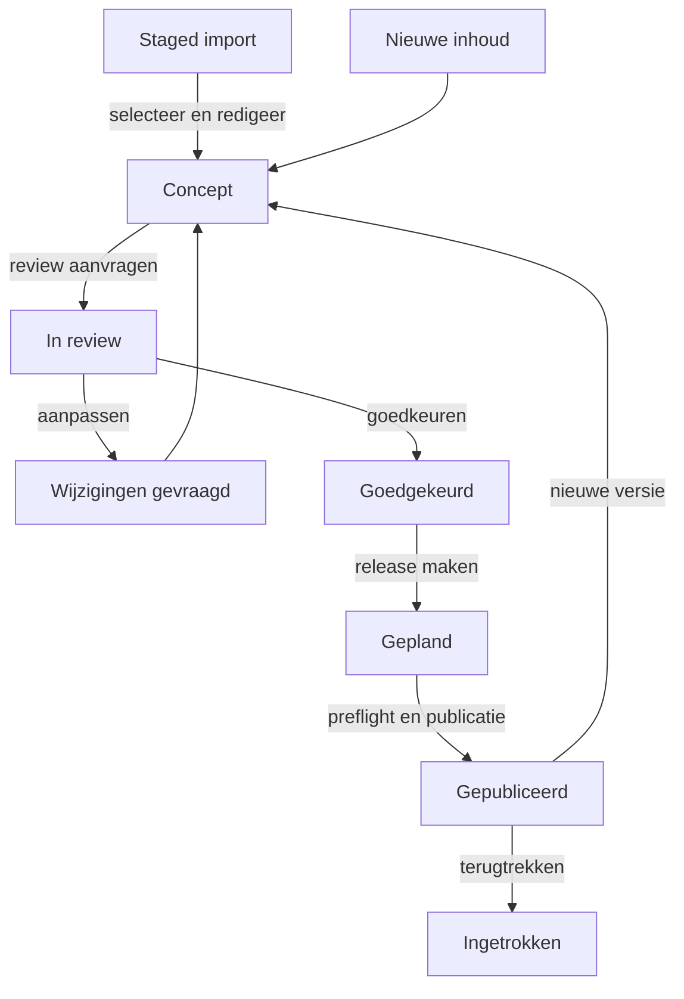

# Functionele specificatie Content Studio

Status: concept voor de eerste implementatie  
Product: Spaansspreken.nl  
Taal van de beheeromgeving: Nederlands

## 1. Doel en afbakening

De Content Studio is de centrale beheeromgeving voor alle leerinhoud van Spaansspreken.nl. De omgeving ondersteunt het maken, redigeren, beoordelen, testen, publiceren en terugtrekken van inhoud zonder wijzigingen in broncode.

De Content Studio is de enige bron waaruit de game gepubliceerde inhoud mag laden. Espaans.nl, Spaanswoordvandedag.nl en andere platformen zijn geen runtime-afhankelijkheden. Bestanden uit andere platformen kunnen alleen als optionele CSV- of JSON-import worden aangeboden. Geïmporteerde records komen altijd in een afgeschermde stagingstatus en worden nooit automatisch gepubliceerd.

### 1.1 Doelen

- Eén canoniek contentmodel gebruiken voor website, game, gesprekken en oefeningen.
- Meerdere redacteuren gecontroleerd laten samenwerken.
- Herkomst, gebruiksrechten en wijzigingen aantoonbaar vastleggen.
- Een volledige missie of gesprekssituatie kunnen voorvertonen voordat spelers deze zien.
- Publicaties reproduceerbaar, planbaar en terug te draaien maken.
- Bestaande woordenlijsten als inspiratie benutten zonder ongecontroleerd data over te nemen.

### 1.2 Niet in de eerste versie

- Rechtstreekse synchronisatie met externe websites of databases.
- Automatisch publiceren van geïmporteerde of door AI gegenereerde inhoud.
- Vrije productie-editie van een reeds gepubliceerde versie.
- Betalings-, account- of spelersbeheer; deze functies krijgen een eigen beheergebied.
- Automatisch vaststellen dat extern materiaal juridisch herbruikbaar is.

## 2. Ontwerpprincipes

1. **Concept als veilige standaard.** Nieuwe, gekopieerde, geïmporteerde en gegenereerde inhoud begint nooit gepubliceerd.
2. **Menselijke eindcontrole.** Alleen een bevoegde uitgever kan een goedgekeurde versie publiceren.
3. **Herkomst vóór hergebruik.** Onvoldoende gedocumenteerde rechten blokkeren publicatie.
4. **Versies zijn onveranderlijk.** Wijzigen na publicatie maakt een nieuwe conceptversie.
5. **Relaties zijn expliciet.** Een missie verwijst naar specifieke versies van scènes, gesprekken, oefeningen en beloningen.
6. **Voorvertoning gebruikt dezelfde renderer.** Preview en productie interpreteren content op dezelfde manier.
7. **Geen stille reparaties.** Normalisatie en deduplicatie leveren voorstellen op; betekenisvolle wijzigingen vragen bevestiging.
8. **Didactiek is onderdeel van het model.** Niveau, leerdoel, vaardigheid en verwachte taaluitkomst zijn geen losse notities.

## 3. Begrippen en contentobjecten

| Object | Functie | Belangrijkste relaties |
|---|---|---|
| Leeritem | Canonieke eenheid voor woord, woordgroep of zin | Vertaling, woordsoort, voorbeelden, audio, tags |
| Leerdoel | Wat de speler na een onderdeel kan begrijpen of zeggen | CEFR-niveau, vaardigheid, leeritems |
| Oefening | Concrete opdracht met antwoord- en feedbacklogica | Leerdoelen, leeritems, media |
| Gesprek | Vertakkende dialoog met rollen, beurten en beoordelingsregels | NPC, scène, leerdoelen, zinnen, rubric |
| Scène | Visuele locatie met personages, objecten en beschikbare acties | Gesprekken, oefeningen, media |
| Missie | Speelbare reeks doelen en scènes met voorwaarden en uitkomsten | Scènes, gesprekken, beloningen |
| Wereldlocatie | Plaats op de kaart van Spanje, bijvoorbeeld Madrid of een bakkerij | Scènes, missies, regio, culturele metadata |
| Personage/NPC | Spelfiguur met identiteit, toon en gespreksrol | Gesprekken, media, locaties |
| Beloning | Item, badge, ervaringspunten, Confianza of Valentía | Missies, voorwaarden |
| Mediabestand | Afbeelding, audio, video of transcript met rechteninformatie | Alle bovenstaande objecten |
| Taxonomie | Beheerde lijst van niveaus, thema's, vaardigheden en grammaticale kenmerken | Alle inhoud |
| Release | Vastgelegde set goedgekeurde contentversies | Publicatiemoment en kanaal |

Ieder contentobject heeft ten minste een stabiel intern ID, type, titel/label, status, taal, eigenaar, versie, herkomst, aangemaakt-door, bijgewerkt-door en tijdstempels. Slugs zijn uniek binnen objecttype en taal, maar zijn niet het primaire ID.

## 4. Rollen en bevoegdheden

Rechten worden server-side afgedwongen. De interface verbergt daarnaast acties waarvoor de gebruiker geen bevoegdheid heeft.

| Rol | Lezen | Maken/bewerken | Importeren | Reviewen | Goedkeuren | Publiceren | Rollen beheren |
|---|---:|---:|---:|---:|---:|---:|---:|
| Beheerder | Ja | Ja | Ja | Ja | Ja | Ja | Ja |
| Hoofdredacteur | Ja | Ja | Ja | Ja | Ja | Ja | Nee |
| Redacteur | Ja | Ja, eigen/toegewezen inhoud | Nee | Nee | Nee | Nee | Nee |
| Taalreviewer | Ja | Alleen reviewnotities en correctievoorstellen | Nee | Ja | Ja | Nee | Nee |
| Importbeheerder | Ja | Alleen importbatch en staged records | Ja | Nee | Nee | Nee | Nee |
| Auditor | Ja | Nee | Nee | Nee | Nee | Nee | Nee |

Aanvullende regels:

- Een redacteur kan een eigen concept niet zelf goedkeuren wanneer vier-ogencontrole voor het contenttype actief is.
- Alleen Beheerder en Hoofdredacteur mogen publicatiereleases beheren.
- Een Taalreviewer beoordeelt taal, didactiek en culturele juistheid, maar kan niet publiceren.
- Een Importbeheerder kan een batch annuleren of staged records verwijderen zolang daaruit nog geen redactionele concepten zijn gemaakt.
- Alle rol- en rechtenwijzigingen worden geaudit.

## 5. Navigatie en schermen

### 5.1 Dashboard

Toont taken die actie vereisen:

- toegewezen concepten en naderende deadlines;
- imports met fouten, ontbrekende rechten of deduplicatievragen;
- reviewverzoeken en gevraagde wijzigingen;
- goedgekeurde inhoud die nog niet in een release staat;
- geplande releases en publicatiefouten;
- recente wijzigingen en waarschuwingen voor verbroken relaties.

Filters: eigenaar, contenttype, status, niveau, locatie, thema, datum en importbatch.

### 5.2 Contentcatalogus

Eén zoek- en filterinterface voor alle contentobjecten. Ondersteunt:

- zoeken op titel, Spaanse tekst, Nederlandse tekst, slug en ID;
- filters op type, status, CEFR-niveau, vaardigheid, thema, locatie, eigenaar, bron en licentiestatus;
- sorteren, opgeslagen weergaven en bulktoewijzing;
- uitsluitend veilige bulkacties: eigenaar/tags wijzigen, review aanvragen, exporteren of staged records verwijderen;
- relatie-indicatoren: waar wordt dit object gebruikt?

Bulkpublicatie buiten een release is niet toegestaan.

### 5.3 Leeritemeditor

Velden zijn afhankelijk van het subtype woord, woordgroep of zin. Ondersteuning omvat:

- Spaanse schrijfwijze en genormaliseerde zoekvorm;
- Nederlandse betekenis of betekenissen;
- woordsoort, lidwoord, grammaticaal geslacht, getal en reflexiviteit;
- lemma en relevante verbuigingen/vervoegingen;
- contextlabel, register en regionale variant;
- voorbeeldzin, vertaling en gekoppelde audio;
- CEFR-niveau, thema, leerdoelen en valkuilen voor Nederlandstaligen;
- toegestaan antwoordvarianten en beoordelingsnotities;
- herkomst- en licentiegegevens.

### 5.4 Gespreksbouwer

Een visuele node-editor en toegankelijke lijstweergave voor vertakkende gesprekken. Iedere node bevat:

- spreker en intentie;
- vaste tekst, dynamische prompt of beide;
- verwachte betekenis, toegestane taalhandelingen en voorbeeldantwoorden;
- beoordelingsrubric voor inhoud, begrijpelijkheid, woordkeuze en uitspraak;
- hints, herkansing en terugvalroute;
- overgangsvoorwaarden en gevolgen voor missie/NPC/gebruiker;
- maximale beurten, time-out en veilige afbreekroute.

De editor waarschuwt voor onbereikbare nodes, doodlopende routes zonder expliciet einde, cycli zonder limiet, ontbrekende fallback en variabelen die voor gebruik niet zijn gezet. AI-instructies zijn versieerbare content en mogen geen geheime sleutels of persoonsgegevens bevatten.

### 5.5 Scène- en missiebouwer

Hier worden locaties, visuele lagen, NPC's, klikbare objecten, leeractiviteiten en voortgangsvoorwaarden samengesteld. De bouwer toont:

- start- en eindvoorwaarden;
- route door scènes en gesprekken;
- vereiste en optionele leerdoelen;
- beloningen en faal-/herstelroutes;
- afhankelijkheden en minimaal vereiste contentversies;
- mobiele en desktoppreview.

De eerste vertical slice gebruikt de wereldlocatie Madrid en de scène La panadería.

### 5.6 Oefeningeditor

Ondersteunt minimaal:

- meerkeuze;
- koppelen en ordenen;
- invullen/schrijven;
- luisteren en begrijpen;
- nazeggen;
- gestuurd spreken;
- vrij spreken met rubric.

Elke oefening bevat instructie, invoermodus, oplossing of beoordelingsrubric, feedback per foutcategorie, hintbeleid, herkansingsbeleid en toegankelijk alternatief waar mogelijk.

### 5.7 Mediabeheer

Functies:

- upload, veilige bestandsvalidatie en metadata-extractie;
- tags, beschrijving, alt-tekst, transcript en ondertitelgegevens;
- spreker/stem, accent/regio en opnamedatum voor audio;
- maker, bron, licentie, toestemmingsbewijs en vervaldatum;
- varianten voor resolutie of kanaal, zonder het origineel te overschrijven;
- overzicht van alle content die een bestand gebruikt;
- blokkade op verwijderen wanneer een gepubliceerde versie het bestand gebruikt.

WebM/Opus-opnames van spelers vallen buiten de contentbibliotheek en worden niet tussen redactionele media getoond.

### 5.8 Importcentrum

Toont batches met status, bron, aanvrager, rechtenverklaring, aantallen, fouten, duplicaten en redactionele voortgang. De volledige functionele uitwerking staat in [import-workflow.md](import-workflow.md).

### 5.9 Reviewwachtrij

Reviewers kunnen:

- content en afhankelijkheden naast de vorige versie bekijken;
- opmerkingen plaatsen op veld- of objectniveau;
- validatieresultaten en preview doorlopen;
- goedkeuren of wijzigingen aanvragen met motivatie;
- een controlelijst per contenttype aftekenen.

Een goedkeuring geldt uitsluitend voor de beoordeelde versie en vervalt zodra inhoudelijke velden wijzigen.

### 5.10 Releases

Een release bevat een naam, omschrijving, doelkanaal, gewenste publicatietijd, goedgekeurde contentversies en eigenaar. Het scherm voert een preflight uit op relaties, rechten, status, media en technische compatibiliteit.

Mogelijke kanalen:

- preview;
- staging;
- productie.

Publicatie naar productie vereist een expliciete bevestiging met een overzicht van toevoegingen, wijzigingen en terugtrekkingen.

### 5.11 Auditlog en instellingen

Het auditlog is doorzoekbaar op gebruiker, actie, object, release, batch en periode. Instellingen bevatten taxonomieën, contenttemplates, reviewchecklists en roltoewijzingen. Wijzigingen aan taxonomieën tonen vooraf de impact op bestaande inhoud.

## 6. Statusmodel en redactionele workflow

### 6.1 Statussen

| Status | Betekenis | Mogelijke vervolgstap |
|---|---|---|
| Staged | Onbewerkte import in quarantaine | Omzetten naar concept, overslaan of verwijderen |
| Concept | Bewerkbare redactionele versie | Review aanvragen of archiveren |
| In review | Vergrendelde versie wordt beoordeeld | Goedkeuren of wijzigingen aanvragen |
| Wijzigingen gevraagd | Review heeft aanpassingen nodig | Bewerken en opnieuw indienen |
| Goedgekeurd | Versie voldoet inhoudelijk | Aan release toevoegen |
| Gepland | Goedgekeurde versie zit in geplande release | Publiceren of uit release halen |
| Gepubliceerd | Actieve productieversie | Nieuwe conceptversie maken of terugtrekken |
| Ingetrokken | Niet meer actief voor nieuwe sessies | Opvolgversie publiceren |
| Gearchiveerd | Niet-actieve redactionele inhoud | Heropenen als nieuw concept |

`Staged` is uitsluitend bedoeld voor imports. Een staged record is niet adresseerbaar via publieke API's, kan niet aan een missie worden gekoppeld en kan niet rechtstreeks naar `In review`, `Goedgekeurd` of `Gepubliceerd`.

### 6.2 Workflow

Statusovergangen zijn transacties: bij een fout blijft de vorige status actief. Iedere overgang registreert actor, tijd, reden en versie.

## 7. Validatie

### 7.1 Validatieniveaus

1. **Direct in het formulier:** vereiste velden, formaat, bereik en lokale consistentie.
2. **Bij reviewaanvraag:** inhoudelijke volledigheid, relaties en didactische metadata.
3. **Bij goedkeuring:** reviewchecklist, herkomst/rechten en previewresultaat.
4. **Bij release-preflight:** volledige afhankelijkheidsgraaf, versies, technische contracten en publicatieconflicten.

Validaties hebben ernst `blokkerend`, `waarschuwing` of `informatie`. Alleen blokkerende fouten verhinderen de actie. Het negeren van een waarschuwing vereist een reden en wordt geaudit.

### 7.2 Algemene regels

- Verplichte titel, eigenaar, taal, contenttype, status en herkomst.
- Geen onbekende taxonomiewaarden of verwijzingen naar verwijderde objecten.
- Unieke slug binnen objecttype en taal.
- Veilige tekstopmaak; scripts en niet-toegestane HTML worden geweigerd.
- Publiceerbare media hebben alt-tekst of transcript waar het medium dat vereist.
- Alle afhankelijkheden zijn goedgekeurd of reeds gepubliceerd in een compatibele versie.
- Rechtenstatus `onbekend`, `beperkt tot inspiratie` of `verlopen` blokkeert publicatie van overgenomen tekst/media.

### 7.3 Spaanse taalregels

- Een zelfstandig naamwoord met vastgelegd Spaans lidwoord heeft een passend geslacht/getal.
- De Nederlandse vertaling van een zelfstandig naamwoord kan inclusief Nederlands lidwoord worden opgeslagen; het lidwoord blijft tevens gestructureerd beschikbaar.
- Een Spaans werkwoord gebruikt als hoofdvorm een infinitief; de Nederlandse hoofdvertaling is eveneens een werkwoord/infinitief.
- Voor zinnen worden beginhoofdletter, eindinterpunctie en omgekeerde Spaanse vraag-/uitroeptekens gecontroleerd met een overridable waarschuwing.
- Genormaliseerde zoekvormen verwijderen geen betekenisdragende tekens uit de getoonde tekst; `sí` en `si` blijven inhoudelijk verschillende vormen.
- Regionale varianten krijgen een expliciet label en worden niet als universele standaard gepresenteerd.

### 7.4 Gesprekken en missies

- Iedere route heeft een expliciet startpunt en minstens één geldig eindpunt.
- Iedere vrije spreekbeurt bevat een rubric, fallback en voorbeeld van een minimaal geslaagd antwoord.
- Variabelen en voorwaarden zijn typeveilig en verwijzen naar bestaande waarden.
- Beloningen kunnen per missie-uitvoering niet onbedoeld dubbel worden toegekend.
- Een speler kan bij een technisch mislukte spraakbeoordeling verder via herkansing of een toegankelijke alternatiefroute.

## 8. Deduplicatie

Deduplicatie wordt uitgevoerd bij import, handmatig aanmaken en samenvoegen. Kandidaten worden gevonden op:

1. gelijk canoniek ID of eerder vastgelegde externe sleutel;
2. exacte combinatie van genormaliseerde Spaanse vorm, type en betekenis;
3. gelijke lemma-/woordsoortcombinatie met overlappende betekenis;
4. fuzzy overeenkomst als suggestie, nooit als automatische beslissing.

Normalisatie voor zoeken kan Unicode-vormen, hoofdletters, overtollige spaties en interpunctie harmoniseren. Accenten, `ñ`, grammaticaal geslacht, reflexiviteit en woordsoort mogen niet stil worden genegeerd bij het bepalen van identiteit.

Bij een kandidaat kiest de gebruiker:

- staged record overslaan;
- staged record als bron/notitie aan bestaand object koppelen;
- velden vergelijken en geselecteerde waarden naar een nieuwe conceptversie kopiëren;
- bewust als afzonderlijk object behouden, met motivatie.

Samenvoegen is nooit destructief voor historie: bron-ID's, provenance, vorige versies en auditregels blijven behouden.

## 9. Herkomst, licentie en AI-labeling

Ieder object en mediabestand bevat waar van toepassing:

- bronsoort: eigen creatie, import, licentie, publieke bron, AI-ondersteund of afgeleid;
- bronnaam en verwijzing/URL/bestand;
- oorspronkelijke maker of rechthebbende;
- licentietype en licentieversie;
- toegestane toepassingen en eventuele attributietekst;
- datum van verkrijging en bewijs/toestemmingsbestand;
- importbatch en oorspronkelijke rij/sleutel;
- inhoudelijke bewerker en datum van laatste menselijke controle.

Voor externe lijsten geldt:

- De gebruiker bevestigt vóór verwerking dat het bestand rechtmatig is verkregen.
- `Alleen ter inspiratie` is de veilige standaard wanneer hergebruik niet aantoonbaar is toegestaan.
- In dat geval mag de broninhoud worden bekeken om thema's of hiaten te ontdekken, maar niet ongewijzigd worden gepubliceerd.
- Een redacteur maakt een zelfstandig geschreven concept en de historie behoudt dat een externe bron als inspiratie is gebruikt.
- Media zonder aantoonbaar publicatierecht kunnen niet naar de mediabibliotheek voor productie worden gepromoveerd.

Door AI voorgestelde teksten krijgen model/provider, generatiedatum, prompttemplateversie en status `menselijke controle vereist`. AI mag geen licentieverklaring invullen of de review overslaan.

## 10. Preview en publicatie

### 10.1 Preview

Preview ondersteunt drie niveaus:

- objectpreview: één leeritem, oefening of gesprek;
- contextpreview: object binnen scène of missie;
- releasepreview: complete geplande set zoals die op staging werkt.

De preview toont duidelijk een niet-productiebanner, contentversie, apparatenweergave, gekozen spelersniveau en simulatievariabelen. Voor gesprekken kan een redacteur elke route handmatig doorlopen, testinvoer inspreken of tekstinvoer simuleren en beoordelingsdetails inzien.

Een deelbare previewlink is tijdelijk, alleen toegankelijk voor geauthenticeerde bevoegde gebruikers en niet indexeerbaar. Previewgegevens tellen niet mee als echte spelersvoortgang of analytics.

### 10.2 Publicatie

- Alleen goedgekeurde, rechten-technisch publiceerbare versies kunnen in een productierelease.
- De release-preflight levert een deterministisch resultaat en bewaart het rapport.
- Publicatie wisselt de actieve release atomair: spelers krijgen nooit een gedeeltelijk gepubliceerde set.
- Lopende missies blijven op de contentversie waarmee de sessie begon, tenzij een expliciete noodmigratie bestaat.
- Terugdraaien activeert een eerder bekende goede release als nieuwe release-actie; historie wordt niet gewist.
- Een spoedintrekking vereist reden, bevoegde gebruiker en impactmelding voor afhankelijke content.

## 11. Audit trail en versiebeheer

Het auditlog is append-only en bevat minimaal:

- tijdstip in UTC en weergegeven lokale tijd;
- actor en diens rol op het moment van handelen;
- actie, objecttype, object-ID en versie;
- oude en nieuwe waarden of een gestructureerde diff;
- reden/opmerking bij status-, rechten- en publicatiewijzigingen;
- importbatch, release of review waartoe de actie behoort;
- request-/correlatie-ID en uitkomst.

Gevoelige technische waarden en persoonsgegevens worden niet in diffs opgeslagen. Auditregels kunnen niet via de reguliere interface worden aangepast of verwijderd. Bewaartermijnen worden later in het privacy- en beveiligingsbeleid vastgesteld.

Een gepubliceerde versie is onveranderlijk. `Bewerken` maakt een nieuwe conceptversie met verwijzing naar de voorganger. De interface kan twee versies veld voor veld vergelijken en toont ook gewijzigde relaties.

## 12. Zoek-, export- en API-gedrag

- Publieke/game-API's leveren uitsluitend de actieve gepubliceerde release.
- Beheer-API's vereisen rolgebaseerde authenticatie en CSRF-/sessiebescherming waar passend.
- Exports vermelden object-ID, versie, status, taal, herkomst en exporttijd.
- Een export van imports of externe content respecteert licentie- en toegangsbeperkingen.
- Zoekindexen voor productie worden pas na een geslaagde release bijgewerkt.
- Verwijderde of ingetrokken content verdwijnt uit nieuwe spelersroutes, maar historische spelersresultaten behouden een referentie naar de gebruikte versie.

## 13. Acceptatiecriteria eerste versie

1. **Autorisatie:** gegeven een Redacteur, wanneer die een release probeert te publiceren via UI of API, dan wordt de actie geweigerd en geaudit.
2. **Veilige creatie:** gegeven nieuwe handmatige inhoud, wanneer deze wordt opgeslagen, dan is de status `Concept` en is er geen publieke API-route naar het object.
3. **Importquarantaine:** gegeven een geslaagde CSV/JSON-import, wanneer de batch klaar is, dan staan alle records op `Staged` en kan geen record rechtstreeks worden gepubliceerd.
4. **Provenance:** gegeven geïmporteerde inhoud, wanneer deze tot concept wordt gepromoveerd, dan blijven batch, bronbestand en oorspronkelijke rij/sleutel herleidbaar.
5. **Rechtenblokkade:** gegeven content met onbekende of alleen-ter-inspiratie-rechten, wanneer een reviewer deze probeert goed te keuren, dan blokkeert het systeem publiceerbare overname totdat een zelfstandig concept of geldige rechtenregistratie bestaat.
6. **Vier-ogencontrole:** gegeven een door een Redacteur gemaakte versie, wanneer vier-ogencontrole actief is, dan kan dezelfde gebruiker die versie niet goedkeuren.
7. **Versies:** gegeven gepubliceerde inhoud, wanneer `Bewerken` wordt gekozen, dan blijft de gepubliceerde versie onveranderd en ontstaat een nieuwe conceptversie.
8. **Validatie:** gegeven een gesprek met een onbereikbare node of ontbrekende fallback, wanneer review wordt aangevraagd, dan toont het systeem een blokkerende fout met de betreffende node.
9. **Deduplicatie:** gegeven een geïmporteerd leeritem dat exact overeenkomt met bestaand materiaal, wanneer de batch wordt verwerkt, dan wordt een duplicaatbeslissing gevraagd en vindt geen stille samenvoeging plaats.
10. **Preview:** gegeven een complete Madrid/La panadería-missie, wanneer de redacteur contextpreview opent, dan kan die de mobiele en desktoproute inclusief spreekfallback doorlopen zonder echte voortgang te schrijven.
11. **Release-preflight:** gegeven een release met een niet-goedgekeurde afhankelijkheid, wanneer preflight draait, dan blokkeert publicatie en benoemt het rapport de volledige afhankelijkheidsroute.
12. **Atomaire publicatie:** gegeven een geldige release, wanneer publicatie slaagt, dan zien nieuwe sessies uitsluitend de nieuwe volledige set; bij falen blijft de vorige set actief.
13. **Rollback:** gegeven een fout in de actieve release, wanneer een bevoegde gebruiker de vorige versie opnieuw activeert, dan gebeurt dat via een nieuwe geaudite release-actie zonder historie te wissen.
14. **Audit:** gegeven een wijziging van inhoud, rechten, status of rol, wanneer de actie slaagt of wordt geweigerd, dan is actor, tijd, doel, resultaat en relevante diff/reden terug te vinden.
15. **Toegankelijkheid:** gegeven de gesprek- en missiebouwer, wanneer deze zonder muis wordt gebruikt, dan zijn alle essentiële acties en de lijstweergave via toetsenbord bereikbaar.

## 14. Definition of Done per contenttype

Een contentobject is pas publiceerbaar wanneer:

- verplichte velden en relaties geldig zijn;
- niveau, leerdoel en doelgroep zijn ingevuld;
- taal en vertaling inhoudelijk zijn gecontroleerd;
- bron, rechten en benodigde attributie zijn vastgelegd;
- media toegankelijkheidsmetadata hebben;
- relevante routes en feedback in preview zijn getest;
- de toepasselijke reviewchecklist is afgetekend;
- de exacte versie is goedgekeurd;
- alle afhankelijkheden in dezelfde release publiceerbaar zijn.
