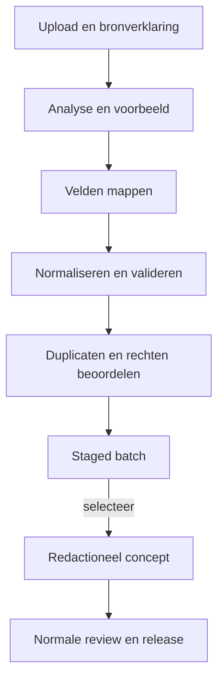

# Functionele specificatie importworkflow

Status: concept voor de eerste implementatie  
Onderdeel van: Content Studio Spaansspreken.nl

## 1. Doel en veiligheidsgrens

De importfunctie helpt redacteuren om optionele woordenlijsten en later ook zinnen uit andere platformen als inspiratie te inventariseren. Een import is geen synchronisatie en geen publicatiekanaal.

De veiligheidsgrens is absoluut:

- iedere geïmporteerde rij komt eerst in een afzonderlijke staged dataset;
- staged data is niet beschikbaar voor spelers, publieke API's, zoekmachines of missiebouwers;
- er is geen instelling voor automatisch goedkeuren of publiceren;
- alleen een menselijke selectie kan tot een normaal redactioneel concept worden omgezet;
- dit concept doorloopt daarna validatie, review, goedkeuring en een release zoals handmatig gemaakte inhoud;
- onbekende of beperkte gebruiksrechten blokkeren letterlijke publicatie.

## 2. Ondersteunde invoer

### 2.1 Eerste versie

- CSV in UTF-8, met configureerbaar scheidingsteken komma, puntkomma of tab.
- JSON als array van objecten of als object met één te kiezen recordarray.
- Maximaal één logisch recordtype per batch.
- Eerste primaire recordtype: `leeritem` met subtype woord, woordgroep of zin.

Ondersteuning voor conversaties, oefeningen en missies is een latere uitbreiding. Losse voorbeeldzinnen mogen in de eerste versie als velden van een leeritem worden geïmporteerd, maar vormen pas na redactionele promotie zelfstandige content waar nodig.

### 2.2 Bestandscontrole

Vóór inhoudelijke verwerking controleert het systeem:

- toegestane extensie en gedetecteerd MIME-/inhoudstype;
- configureerbare maximale bestandsgrootte en maximaal aantal records;
- geldige UTF-8 of een expliciet gekozen broncodering die veilig naar UTF-8 wordt omgezet;
- geen uitvoerbare inhoud, macro's of archieven;
- geldige CSV-structuur of parseerbare JSON;
- consistente kolomkoppen/JSON-paden;
- bescherming tegen spreadsheetformules bij latere CSV-export;
- virus-/malwarescan indien de infrastructuur deze dienst ondersteunt.

Het oorspronkelijke bestand wordt onveranderd en niet publiek toegankelijk bewaard volgens een vastgestelde bewaartermijn. Er wordt een hash opgeslagen zodat herhaalde uploads herkenbaar zijn.

## 3. Importrollen

- **Importbeheerder:** uploadt, beschrijft de bron, maakt mapping, beoordeelt fouten en rondt staging af.
- **Redacteur:** selecteert staged records en maakt er zelfstandige concepten van.
- **Taalreviewer:** beoordeelt de uiteindelijke conceptversie, niet de onbewerkte batch.
- **Hoofdredacteur/Beheerder:** beheert uitzonderingen, publicatierechten en bron-/licentiebeleid.
- **Auditor:** kan batch, beslissingen, provenance en logs alleen lezen.

Een Importbeheerder kan niets publiceren en kan geen rechtenstatus `goedgekeurd voor publicatie` toekennen zonder de daarvoor vereiste bevoegdheid.

## 4. Batchstatussen

| Batchstatus | Betekenis |
|---|---|
| Geüpload | Bestand is veilig opgeslagen maar nog niet geanalyseerd |
| Geanalyseerd | Structuur, voorbeeldwaarden en mogelijke mappings zijn bekend |
| Mapping vereist | Gebruiker moet bronvelden aan canonieke velden koppelen |
| Validatie vereist | Mapping bestaat; records moeten worden gecontroleerd |
| Beslissingen vereist | Er zijn blokkerende fouten, rechtenvragen of duplicaatkeuzes |
| Klaar voor staging | Alle batchbrede blokkades zijn opgelost |
| Staged | Geldige records zijn geïsoleerd beschikbaar voor redactionele selectie |
| Gedeeltelijk staged | Geldige records zijn staged; overige records zijn afgewezen |
| Geannuleerd | Batch is gestopt zonder publiceerbare content te maken |
| Afgerond | Gewenste records zijn verwerkt of bewust overgeslagen |

Recordstatussen binnen een batch zijn minimaal `geldig`, `waarschuwing`, `ongeldig`, `mogelijk duplicaat`, `staged`, `gepromoveerd`, `overgeslagen` en `verwijderd`.

## 5. Workflow



### Stap 1: bron registreren

De gebruiker vult vóór verwerking in:

- interne batchnaam en doel;
- bronplatform of bronbestand;
- datum van verkrijging;
- maker/rechthebbende indien bekend;
- licentie of toestemming indien bekend;
- gekozen gebruik: `herbruikbaar volgens licentie`, `eigen materiaal` of `alleen ter inspiratie`;
- verklaring dat de gebruiker bevoegd is het bestand binnen dit doel te verwerken;
- optionele bron-URL, contactpersoon, notitie en bewijsbestand.

De veilige standaard is `alleen ter inspiratie`. Een licentieclaim wordt niet automatisch afgeleid uit een URL of bestandsnaam.

### Stap 2: analyse en voorbeeld

Het systeem detecteert:

- bestandstype, codering, scheidingsteken en header;
- aantal records en velden;
- lege waarden, datatypen en voorbeeldwaarden;
- vermoedelijke kolommen op basis van kop en inhoud;
- onregelmatige rijen of JSON-objecten;
- mogelijke geheime of persoonlijke gegevens, met een waarschuwing.

De interface toont maximaal een veilige steekproef en maskeert verdachte persoonsgegevens. De gebruiker bevestigt structuur en recordtype voordat mapping start.

### Stap 3: mapping maken

De gebruiker koppelt bronvelden via keuzelijsten aan canonieke velden. Automatische suggesties moeten zichtbaar als suggestie zijn en vragen bevestiging. Een opgeslagen mappingtemplate hoort bij een expliciete bronvariant en versie; een template wordt niet stil toegepast wanneer kolommen zijn gewijzigd.

Ondersteunde transformaties zijn voorspelbaar en voorvertoonbaar:

- trimmen van omliggende witruimte;
- lege waarden omzetten naar `null`;
- vaste waarde instellen, bijvoorbeeld brontaal `es`;
- waarden mappen via een zichtbare tabel, bijvoorbeeld `znw` naar `zelfstandig_naamwoord`;
- één bronveld splitsen op een gekozen scheidingsteken;
- velden samenvoegen voor een notitie;
- Spaans lidwoord gecontroleerd herkennen als apart veld;
- tags splitsen en naar bestaande taxonomiewaarden mappen.

Vrije scripts of SQL in mappings zijn niet toegestaan.

### Stap 4: dry run, normalisatie en validatie

Een dry run schrijft nog geen staged records. De uitkomst toont:

- totaal, geldig, waarschuwing, ongeldig en mogelijk duplicaat;
- fouten per veld en per rij/JSON-sleutel;
- oorspronkelijke waarde, getransformeerde waarde en canonieke preview;
- impact van normalisatie;
- downloadbaar foutenrapport zonder gevoelige systeeminformatie.

De gebruiker kan mapping aanpassen en de dry run herhalen. Dezelfde bestands-hash, mappingversie en validatieregelversie moeten dezelfde uitkomst geven.

### Stap 5: deduplicatie en rechtenbeslissingen

Alle kandidaten worden vóór staging geclassificeerd:

- nieuw;
- exact bestaand;
- mogelijk bestaand;
- eerder uit dezelfde bron geïmporteerd;
- conflicterende externe sleutel.

Beslissingen kunnen per record of voor een groep identieke gevallen worden genomen. Een groepsbeslissing toont vooraf welke records worden geraakt. Het systeem voert geen fuzzy merge automatisch uit.

### Stap 6: staging bevestigen

Voor bevestiging toont het systeem een samenvatting van:

- de bron- en rechtenregistratie;
- het aantal staged, afgewezen en overgeslagen records;
- mapping- en validatieversie;
- open waarschuwingen;
- retentie van origineel bestand en staged data.

Na bevestiging ontstaan geïsoleerde staged records met een onveranderlijke verwijzing naar bestand, batch en oorspronkelijke rij/JSON-sleutel.

### Stap 7: naar concept promoveren

Een Redacteur opent een staged record naast eventuele bestaande content en kiest:

- nieuw zelfstandig concept maken;
- geselecteerde bruikbare gegevens in een conceptversie van bestaand materiaal overnemen;
- alleen als inspiratie registreren en zelf nieuwe formulering schrijven;
- overslaan met reden.

Promotie kopieert nooit blind de status of rechtenclaim uit het bronbestand. De redacteur vult ontbrekende didactiek, vertaling, context en herkomst aan. De nieuwe versie krijgt status `Concept`.

### Stap 8: normale redactionele route

Na promotie bestaat geen verkorte importroute. Review, goedkeuring, preview, release-preflight en publicatie volgen de regels in [content-studio.md](content-studio.md).

## 6. Canonieke mapping voor leeritems

| Canoniek veld | Verplicht | Voorbeeld | Mapping-/validatieopmerking |
|---|---:|---|---|
| `external_id` | Nee | `word-1042` | Alleen uniek binnen opgegeven bronnamespace |
| `subtype` | Ja | `woord` | `woord`, `woordgroep` of `zin` |
| `es_text` | Ja | `el pan` | Getoonde Spaanse vorm blijft ongewijzigd bewaard |
| `es_lemma` | Soms | `pan` | Vereist voor verbogen vormen; aanbevolen voor woorden |
| `es_article` | Nee | `el` | Gestructureerd; consistent met geslacht/getal |
| `nl_text` | Ja | `het brood` | Eén primaire betekenis; alternatieven apart |
| `part_of_speech` | Voor woorden | `zelfstandig_naamwoord` | Waarden naar beheerde taxonomie mappen |
| `gender` | Soms | `mannelijk` | Alleen wanneer grammaticaal relevant |
| `number` | Nee | `enkelvoud` | Beheerde waarde |
| `reflexive` | Nee | `false` | Alleen geldig voor werkwoorden |
| `register` | Nee | `neutraal` | Bijvoorbeeld formeel, informeel, spreektaal |
| `region` | Nee | `Spanje` | Geen vrije variant als taxonomie verplicht is |
| `cefr_level` | Nee | `A1` | Importwaarde is een suggestie tot review |
| `theme_tags` | Nee | `bakkerij;eten` | Naar bestaande tags mappen of staged tagvoorstel maken |
| `example_es` | Nee | `Quiero comprar pan.` | Taal- en interpunctiecontrole |
| `example_nl` | Bij voorbeeld | `Ik wil brood kopen.` | Paarvalidatie met `example_es` |
| `usage_note` | Nee | `Vaak zonder lidwoord na ...` | Tekst wordt als bronnotitie gemarkeerd |
| `audio_reference` | Nee | `audio/pan.webm` | Geen externe media overnemen zonder rechtencontrole |
| `source_reference` | Ja per batch of rij | `lijst-2026-08` | Mag batchbreed worden ingevuld |
| `license_status` | Ja per batch of rij | `inspiratie` | Veilige standaard `inspiratie` |

Meerdere vertalingen, voorbeelden of tags mogen via afzonderlijke kolommen, een afgesproken separator of JSON-arrays worden aangeleverd. De preview maakt de uiteindelijke structuur zichtbaar.

## 7. Voorbeeld invoercontracten

### 7.1 CSV

```csv
id,spaans,nederlands,woordsoort,niveau,themas
word-1042,el pan,het brood,znw,A1,"bakkerij;eten"
word-1043,comprar,kopen,ww,A1,"winkelen;dagelijks"
```

Deze kolomnamen zijn voorbeelden, geen vaste eis. De gebruiker koppelt ze handmatig of bevestigt een mappingvoorstel.

### 7.2 JSON

```json
{
  "source": "optionele-woordenlijst",
  "items": [
    {
      "id": "word-1042",
      "es": "el pan",
      "nl": "het brood",
      "pos": "noun",
      "level": "A1",
      "tags": ["bakkerij", "eten"]
    }
  ]
}
```

De gebruiker kiest in dit voorbeeld `items` als recordarray en koppelt daarna de velden.

## 8. Normalisatie en taalvalidatie

Het systeem bewaart altijd zowel de oorspronkelijke bronwaarde als de getransformeerde staged waarde.

Toegestane technische normalisatie:

- Unicode normaliseren zonder accenten te verwijderen uit publiceerbare tekst;
- begin-/eindspaties verwijderen en herhaalde gewone spaties signaleren;
- regeleinden uniform maken;
- booleans en beheerde waarden volgens een expliciete mapping omzetten;
- lege strings als leeg veld behandelen.

Betekenisvolle correcties worden niet automatisch uitgevoerd. Voorbeelden:

- `el` vervangen door `la`;
- een vertaling herschrijven;
- `tú` en `tu` gelijkstellen;
- woordsoort of CEFR-niveau definitief bepalen;
- een werkwoordsvorm naar een lemma veranderen.

Specifieke controles:

- Spaanse werkwoorden horen als lemma in de infinitief te staan; afwijkingen geven een waarschuwing.
- Wanneer `es_text` een lidwoord bevat, stelt het systeem uitsplitsing voor en controleert het geslacht.
- Een Nederlandse hoofdvertaling van een werkwoord hoort eveneens een infinitief te zijn.
- Voorbeeldzin en voorbeeldvertaling moeten beide gevuld of beide leeg zijn.
- HTML, JavaScript en ongewenste besturingskarakters worden geweigerd.
- Onbekende taxonomiewaarden worden niet automatisch aangemaakt; ze worden gemapt of als voorstel beoordeeld.

## 9. Deduplicatieproces

### 9.1 Vergelijkingssleutels

Het proces vergelijkt in volgorde:

1. bronnamespace plus `external_id`;
2. eerdere import met dezelfde bestandshash en rijsleutel;
3. exacte genormaliseerde `es_text`, subtype en `nl_text`;
4. lemma plus woordsoort en overlappende betekenis;
5. fuzzy gelijkenis voor handmatige beoordeling.

De genormaliseerde zoekwaarde kan hoofdletters, Unicodevorm, spaties en niet-betekenisvolle randinterpunctie harmoniseren. Accentverschillen, `ñ/n`, lidwoord, geslacht, getal, reflexiviteit en woordsoort blijven zichtbaar in de beslissing.

### 9.2 Beslisinterface

De interface toont bron en bestaand object naast elkaar, inclusief provenance en huidig gebruik. Beschikbare acties:

- overslaan als duplicaat;
- als aanvullende bronreferentie koppelen;
- geselecteerde velden naar een nieuwe conceptversie kopiëren;
- als afzonderlijk object behouden met reden;
- uitstellen voor specialistische beoordeling.

Een actie wijzigt nooit rechtstreeks een gepubliceerde versie. Bij twijfel is `uitstellen` de standaard.

## 10. Provenance en licentie

Voor ieder staged record worden minimaal vastgelegd:

- batch-ID, bestandshash en oorspronkelijke bestandsnaam;
- bronnamespace, externe sleutel en rij-/JSON-pad;
- originele veldwaarden;
- mappingtemplate en versie;
- uitgevoerde transformaties;
- validatieregelversie en resultaten;
- bron, maker, licentie/toestemming en gebruiksdoel van de batch;
- gebruiker en tijd van upload, staging en promotie;
- deduplicatiebeslissing en motivatie.

Rechtenstatussen:

| Status | Gebruik in workflow |
|---|---|
| Eigen materiaal | Kan na inhoudelijke review publiceerbaar worden |
| Toestemming/licentie vastgelegd | Kan na controle van voorwaarden publiceerbaar worden |
| Alleen ter inspiratie | Niet letterlijk publiceren; zelfstandig concept vereist |
| Onbekend | Promotie alleen als inspiratie; publicatie van broninhoud geblokkeerd |
| Niet toegestaan | Niet promoveren; staged record verwijderen of alleen batchaudit bewaren |
| Verlopen/ingetrokken | Nieuwe publicatie geblokkeerd; bestaande impact moet worden beoordeeld |

Attributieverplichtingen worden als publicatievereiste doorgegeven aan het concept en de release-preflight.

## 11. Fouten, herstel en idempotentie

- Een parse- of systeemfout publiceert en promoot niets.
- Een mislukte batch kan na correctie van mapping opnieuw als dry run worden uitgevoerd.
- Herhaalde verwerking met dezelfde batch, mapping en regelversie maakt geen dubbele staged records.
- Een gedeeltelijke staging vermeldt exact welke records wel en niet zijn geschreven.
- Importbewerkingen gebruiken transacties per veilige eenheid; een record is volledig staged of niet aanwezig.
- De gebruiker kan een batch annuleren vóór staging.
- Staged records kunnen batchgewijs worden verwijderd zolang ze niet zijn gepromoveerd; auditmetadata blijft volgens beleid bestaan.
- Een promotie kan niet worden `ongedaan gemaakt` door het concept stil te wissen. Het concept wordt gearchiveerd en de herkomstrelatie blijft bestaan.

## 12. Privacy en beveiliging

- De import is bedoeld voor leercontent, niet voor persoonsgegevens of spelersdata.
- Bij vermoedelijke e-mailadressen, telefoonnummers, tokens of andere gevoelige patronen waarschuwt of blokkeert het systeem volgens beleid.
- Uploads staan buiten de publieke webroot en gebruiken willekeurige interne opslag-ID's.
- Bestandsnamen worden alleen als metadata bewaard en nooit als uitvoerbaar pad gebruikt.
- Parsing gebeurt met limieten voor tijd, geheugen, nesting en recordlengte.
- Formules beginnend met `=`, `+`, `-` of `@` worden bij export veilig geescaped.
- Alleen bevoegde rollen kunnen het origineel of foutenrapport downloaden.
- Downloads, verwijderen en rechtenwijzigingen worden geaudit.

## 13. Auditgebeurtenissen

Minimaal te registreren:

- batch aangemaakt, bestand geüpload en hash vastgesteld;
- bron-/rechtenverklaring toegevoegd of gewijzigd;
- mapping gemaakt, gewijzigd of als template opgeslagen;
- dry run gestart en resultaat;
- duplicaat- en validatiebeslissing;
- staging gestart, voltooid of mislukt;
- record gepromoveerd, overgeslagen of verwijderd;
- batch geannuleerd of afgerond;
- origineel/foutenrapport gedownload;
- iedere geweigerde importactie.

Logs gebruiken correlatie-ID's zodat een batchactie van upload tot concept kan worden gevolgd.

## 14. Acceptatiecriteria eerste versie

1. **Upload:** gegeven een geldige UTF-8 CSV of JSON binnen de limieten, wanneer een Importbeheerder deze uploadt, dan ontstaat één batch met bestandshash en status `Geüpload`.
2. **Veilig bestand:** gegeven een uitvoerbaar, te groot of onparseerbaar bestand, wanneer dit wordt aangeboden, dan weigert het systeem verwerking met een begrijpelijke fout en auditregel.
3. **Bronverklaring:** gegeven een nieuwe batch zonder rechtenregistratie, wanneer de gebruiker wil analyseren/stagen, dan vraagt het systeem minimaal bron en gebruiksdoel; de standaard is `alleen ter inspiratie`.
4. **Flexibele mapping:** gegeven afwijkende kolomnamen, wanneer de gebruiker `spaans`, `nederlands` en `woordsoort` handmatig koppelt, dan toont dry run correcte canonieke velden zonder het origineel te veranderen.
5. **Mappingversie:** gegeven een opgeslagen template en een gewijzigd bronbestand, wanneer kolommen niet meer overeenkomen, dan stopt automatische toepassing en vraagt het systeem bevestiging/hermapping.
6. **Dry run:** gegeven een mapping, wanneer dry run wordt gestart, dan worden nog geen staged of redactionele objecten gemaakt.
7. **Rijfeedback:** gegeven ongeldige waarden, wanneer validatie eindigt, dan kan de gebruiker per rij/JSON-sleutel bronwaarde, transformatie, fout en voorgestelde actie zien.
8. **Taalregels:** gegeven `bailar` met een Nederlandse niet-werkwoordelijke hoofdvertaling, wanneer validatie draait, dan verschijnt minimaal een waarschuwing voor woordsoortconsistentie.
9. **Exact duplicaat:** gegeven een bestaand identiek leeritem, wanneer importvalidatie draait, dan markeert het systeem dit als duplicaat en voegt niets automatisch samen.
10. **Fuzzy kandidaat:** gegeven een vergelijkbare maar niet identieke term, wanneer deze als kandidaat wordt gevonden, dan is handmatige keuze verplicht en blijft uitstellen mogelijk.
11. **Staginggrens:** gegeven een afgeronde import, wanneer een publieke API of missiebouwer zoekt, dan zijn staged records niet zichtbaar of koppelbaar.
12. **Geen snelpad:** gegeven een staged record, wanneer een gebruiker dit probeert goed te keuren of publiceren, dan weigert zowel UI als API die overgang.
13. **Promotie:** gegeven een geselecteerd staged record, wanneer een Redacteur dit promoveert, dan ontstaat status `Concept` met volledige batch-/rijprovenance en zonder wijziging van bestaande gepubliceerde inhoud.
14. **Inspiratiebeperking:** gegeven rechtenstatus `alleen ter inspiratie`, wanneer letterlijke broninhoud richting goedkeuring gaat, dan blokkeert het systeem dit totdat zelfstandig redactioneel werk en controle zijn vastgelegd.
15. **Idempotentie:** gegeven dezelfde batch, mapping en regelversie, wanneer verwerking wordt herhaald, dan ontstaan geen dubbele staged records.
16. **Gedeeltelijke fout:** gegeven tien geldige en twee ongeldige records, wanneer gedeeltelijke staging wordt bevestigd, dan worden exact tien records staged en blijven de twee fouten herleidbaar in het batchrapport.
17. **Verwijderen:** gegeven een staged record zonder promotie, wanneer een bevoegde gebruiker dit verwijdert, dan verdwijnt het uit de staged werkvoorraad en blijft de auditbeslissing behouden.
18. **Audit:** gegeven elke batchstatus, mapping-, rechten-, duplicaat- of promotiewijziging, wanneer de actie plaatsvindt, dan zijn actor, tijd, versie, doel en resultaat doorzoekbaar.

## 15. Rapportage na import

Iedere afgeronde batch levert een vast rapport met:

- bron, gebruiksdoel, rechtenstatus en bestandshash;
- mapping- en validatieversies;
- aantallen per recordstatus;
- foutcategorieën en open beslissingen;
- duplicaten en gekozen afhandeling;
- gepromoveerde concept-ID's;
- overgeslagen/verwijderde records met reden;
- verantwoordelijke gebruikers en tijdstippen.

Dit rapport is de overdracht van importbeheer naar redactie en vormt samen met het auditlog het bewijs dat externe data niet automatisch is gepubliceerd.
